# Awesome-Commercial-Data-Marketplace

# Awesome-Commercial-Data-Marketplace 📊 🛒

  

  

  

  

  

  

  

---

## 🌟 Top Commercial Data Marketplace Ecosystem

**Curated List of Commercial Data Marketplaces & Open-Source Data Exchange Platforms**  

*Focused on Data Product Discovery, Data Monetization, Data Clean Rooms, Privacy-Preserving Analytics & Self-Hosted Data Exchange*

**Last updated: October 2026** 📅

---

### 📌 Overview & SEO Summary

Welcome to the ultimate curated directory of **commercial data marketplaces**, **open-source data exchange platforms**, and **data monetization frameworks**. Whether you are looking for enterprise-grade commercial solutions (such as *AWS Data Exchange*, *Snowflake Marketplace*, and *Databricks Marketplace*), or self-hostable open-source alternatives (like *Open Data Discovery Platform*, *Promethium*, and *Datavault*), this list covers category leaders, data clean rooms, and privacy-respecting data sharing.

**Key Market Context:**

- **Data marketplaces are growing rapidly** — the global data marketplace market is projected to reach **$10.5B by 2030**, driven by AI/ML data demand and privacy regulations.

- **Snowflake Marketplace** leads in **data-as-a-product** with **no data movement** — consumers access provider data directly in their Snowflake account.

- **Open-source data exchange platforms** like **ODDP** and **Promethium** are emerging as **self-hosted alternatives** for organizations that need data sovereignty.

---

## 📑 Table of Contents

- [🏢 SaaS & Commercial Platforms](#-saas--commercial-platforms)

- [🔓 Open-Source GitHub Projects](#-open-source-github-projects)

- [🛠️ How to Contribute](#%EF%B8%8F-how-to-contribute)

- [📊 Star History](#-star-history)

- [🤝 Support & Sponsorship](#-support--sponsorship)

- [⚠️ Disclaimer](#%EF%B8%8F-disclaimer)

---

## 🏢 SaaS / Commercial Platforms

The commercial data marketplace market spans **cloud provider data exchanges** (AWS, Snowflake, Databricks, GCP) that provide **data discovery, delivery, and billing within their ecosystems**, **financial data platforms** (Bloomberg, Quandl, Datarade) that serve **quantitative and financial analysis**, and **enterprise data providers** (Crunchbase, Revelio Labs) that offer **proprietary datasets**. **AWS Data Exchange** charges **per-data-product subscription** with **consolidated AWS billing** . **Snowflake Marketplace** uses **usage-based pricing** integrated with Snowflake billing . **Databricks Marketplace** offers **free and paid listings** with **Unity Catalog governance** . **Datarade** charges **custom pricing** for data providers . **Dawex** uses **custom enterprise pricing** for its data exchange platform .

| SaaS / Commercial Platform | Company / Owner | Valuation / Market Cap | Standard Edition Starting Price | Free Tier / Free Trial Limits | Description |

| :--- | :--- | :--- | :--- | :--- | :--- |

| **[AWS Data Exchange](https://aws.amazon.com/data-exchange/)** ☁️ | Amazon | ~$2.0 Trillion | **Per-data-product subscription** + **consolidated AWS billing**  | **No free tier for premium data**; **free datasets available** | **AWS-native data marketplace** — **3,500+ data products** from **300+ providers** . **Consolidated billing** on AWS invoices . **Data delivery via S3, Redshift, and API** . **Private data sharing** with AWS Organizations . |

| **[Snowflake Marketplace](https://www.snowflake.com/marketplace/)** ❄️ | Snowflake | ~$50 Billion | **Usage-based** integrated with Snowflake billing  | **Free datasets available** | **Data cloud marketplace** — **Share data without movement** — consumers access provider data directly in their Snowflake account . **Paid listings with per-query pricing** . **Native apps** for application distribution. **Provider and consumer profiles** for governance . |

| **[Databricks Marketplace](https://www.databricks.com/product/marketplace)** 🧱 | Databricks | ~$43 Billion | **Free and paid listings**; **Unity Catalog governance**  | **Free datasets available** | **Lakehouse marketplace** — **Data and AI assets** including datasets, notebooks, and ML models . **Delta Sharing** for open data exchange . **Unity Catalog** for governance and lineage . |

| **[Google Cloud Analytics Hub](https://cloud.google.com/analytics-hub)** 🌐 | Google (Alphabet) | ~$2.0 Trillion | **Custom pricing**; **BigQuery integration**  | **Free datasets available** | **GCP-native data exchange** — **BigQuery-native sharing** without data movement . **Pub/Sub integration** for real-time data . **Analytics Hub** for private and public exchanges . |

| **[Bloomberg Data License](https://www.bloomberg.com/professional/product/data-license/)** 📈 | Bloomberg | ~$60 Billion | **Custom enterprise pricing** (per-user/per-feed) | **No free tier**; **trial available** | **Financial data platform** — **Real-time market data, reference data, and historical data** . **The gold standard for financial data** . **Terminal integration** and **API access** . |

| **[Quandl (Nasdaq)](https://data.nasdaq.com/)** 📊 | Nasdaq | ~$30 Billion | **Free: limited datasets**; **Premium: from $29/month**  | **Free: limited datasets**  | **Financial and economic data** — **Alternative data, futures, options, and economic indicators** . **API-first** for quantitative analysis . **Acquired by Nasdaq** in 2018. |

| **[Datarade](https://datarade.ai/)** 🔍 | Datarade | Private | **Custom pricing** (data provider listings) | **Free provider listings**  | **Data marketplace directory** — **2,500+ data providers** across **50+ categories** . **Data discovery and comparison** . **Lead generation** for data providers . **The largest data marketplace aggregator** . |

| **[Dawex](https://www.dawex.com/)** 🔄 | Dawex | Private | **Custom enterprise pricing**  | **Demo available** | **Data exchange platform** — **Data monetization and sharing** for enterprises . **Data clean rooms** for privacy-preserving analytics . **Blockchain-based traceability** . |

| **[Revelio Labs](https://www.reveliolabs.com/)** 👥 | Revelio Labs | Private | **Custom enterprise pricing**  | **Sample data available** | **Workforce intelligence data** — **Employment data from public sources** . **Job postings, headcount, and compensation** . **Used by hedge funds and enterprises** . |

| **[Crunchbase Enterprise](https://www.crunchbase.com/)** 🏢 | Crunchbase | Private | **Custom enterprise pricing** (from $12K/year)  | **Free tier: limited access**  | **Company and investment data** — **Private company data, funding rounds, and acquisitions** . **API access** for enterprise . **The standard for startup and VC data** . |

---

## 🔓 Open-Source GitHub Projects

*Sorted by GitHub_Stars_Count (Descending)* 🌟

- **[Open Data Discovery Platform (ODDP)](https://github.com/opendatadiscovery/odd-platform)**   

  **Open-source data discovery and observability platform**, Apache-2.0 licensed. **The most mature open-source data catalog** — **data discovery, lineage, and observability** . **Collects metadata from 20+ sources** including Snowflake, BigQuery, PostgreSQL, Kafka, and dbt . **Data quality monitoring** with automated alerts . **REST API and SDKs** for integration . **The foundation for building a self-hosted data marketplace** . 📊

- **[Promethium](https://github.com/promethium/promethium)**   

  **Open-source data fabric and virtual data marketplace**, Apache-2.0 licensed. **Data virtualization across heterogeneous sources** . **Federated query engine** — query data without movement . **Data catalog and governance** built-in . **The most complete open-source data fabric** for building data marketplaces . 🔗

- **[Datavault](https://github.com/datavault/datavault)**   

  **Open-source data marketplace and monetization platform**, open-source. **Data product catalog** with **subscription management** . **Payment integration** for monetization . **Access control and usage tracking** . **The most focused open-source data marketplace platform** . 💰

- **[Amundsen (Lyft)](https://github.com/amundsen-io/amundsen)**   

  **Open-source data discovery and metadata engine**, Apache-2.0 licensed. **Data catalog with search and lineage** . **Neo4j graph for relationship mapping** . **Used by Lyft, ING, and other enterprises** . **The most widely adopted open-source data catalog** . 🔍

- **[DataHub (LinkedIn)](https://github.com/datahub-project/datahub)**   

  **Open-source metadata platform for data discovery**, Apache-2.0 licensed. **The most comprehensive open-source data catalog** with **10K+ GitHub stars** . **Metadata ingestion from 50+ sources** . **Data lineage, governance, and discovery** . **The enterprise-grade open-source data marketplace foundation** . 🏢

- **[OpenMetadata](https://github.com/open-metadata/OpenMetadata)**   

  **Open-source metadata platform for data discovery and governance**, Apache-2.0 licensed. **Unified metadata store with 100+ connectors** . **Data lineage, quality, and governance** . **The most modern open-source data catalog** . 📋

- **[Marquez (WeWork)](https://github.com/MarquezProject/marquez)**   

  **Open-source metadata service for data lineage**, Apache-2.0 licensed. **Collects, aggregates, and visualizes data lineage** . **OpenLineage standard** for interoperability . **The standard for open-source data lineage** . 🔗

- **[Magda](https://github.com/magda-io/magda)**   

  **Open-source data catalog for government and enterprise**, Apache-2.0 licensed. **Data discovery and access** for public sector . **Federated data catalog** across agencies . **The leading open-source government data marketplace** . 🏛️

- **[CKAN](https://github.com/ckan/ckan)**   

  **Open-source data portal platform**, AGPL-3.0 licensed. **The most widely adopted open data portal** — powers **data.gov, data.gov.uk, and hundreds of government portals** . **Dataset publishing, search, and APIs** . **The standard for open data marketplaces** . 🌍

- **[DKAN](https://github.com/GetDKAN/dkan)**   

  **Open-source open data platform**, GPL-2.0 licensed. **Drupal-based data catalog** . **Dataset publishing and visualization** . **The most flexible open-source data portal** . 📂

---

## 🛠️ How to Contribute

Contributions are welcome! Follow these steps to submit new data marketplaces or open-source data exchange software:

1. 🍴 **Fork** the repository.

2. 📝 **Add/edit** entries in `README.md` maintaining table/list structure and formatting.

3. 🔗 Include project title, official website/GitHub link, exact Stars_Count, license, and brief description.

4. 🚀 Submit a **Pull Request** with a descriptive summary of your changes.

---

## 📊 Star History

---

## 🤝 Support & Sponsorship

If you find this commercial data marketplace repository useful, please consider supporting the project:

- ⭐ **Star** this repository to increase visibility!

- 🔀 **Fork** and share with fellow data engineers, marketplace operators, and open-source advocates.

- ☕ **Sponsor & Buy Me a Coffee**: Support ongoing open-source curation via the [GitHub Sponsor Dashboard](https://github.com/sponsors/ishandutta2007).

---

## ⚠️ Disclaimer

- This is a **community-curated** list — not exhaustive and not an endorsement. ℹ️

- **AWS Data Exchange and Snowflake Marketplace are consumption-based** — costs scale with data subscriptions and query volume . **Snowflake shares data without movement** — consumers access provider data directly in their Snowflake account . **Plan your data product subscriptions carefully** to avoid unexpected costs.

- **Open-source data marketplaces (ODDP, Promethium, CKAN) are not turnkey** — **ODDP requires metadata ingestion from 20+ sources** . **Promethium requires data virtualization setup** . **CKAN requires Python/Docker deployment** . **Always validate data discovery and access controls with a proof-of-concept** before production deployment . 📊

---

  <b>Made with ❤️ for data engineers, marketplace operators, and open-source data exchange advocates.</b>

